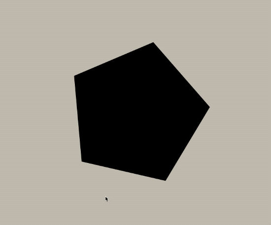
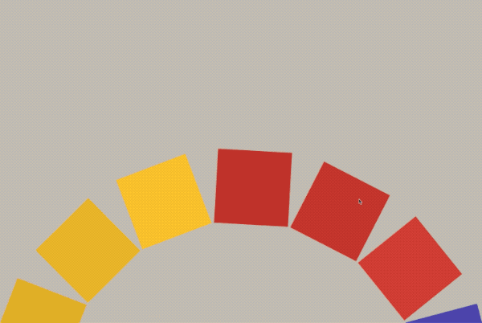
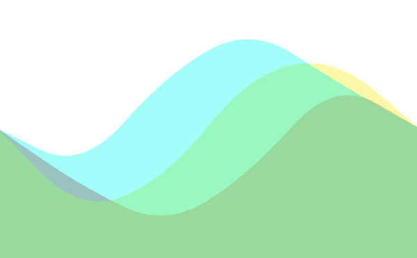

# Awesome Canvas 😀

- [Moving Gradation](https://github.com/Dev-JeromeBaek/awesome-web-styling/tree/master/canvas/moving-gradation)

<!-- - [Moving Sheep Sun Layer](https://github.com/Dev-JeromeBaek/awesome-web-styling/tree/master/canvas/moving-sheep-sun-layer) -->

<!-- - [Ripple Dots Image Colors](https://github.com/Dev-JeromeBaek/awesome-web-styling/tree/master/canvas/ripple-dots-image-colors) -->

- [Rotating Polygons](https://github.com/Dev-JeromeBaek/awesome-web-styling/tree/master/canvas/rotating-polygons)

- [Rotating Polygons 2](https://github.com/Dev-JeromeBaek/awesome-web-styling/tree/master/canvas/rotating-polygons2)

- [Wavy Layer](https://github.com/Dev-JeromeBaek/awesome-web-styling/tree/master/canvas/wavy-layer)

---

<!-- 
 -->

