# Awesome Web Styling with CSS Animation Effects ⭐️

This repository is dedicated to Web styling using HTML5 + CSS3. (often using JavaScript and jQuery.)

I started collecting component items for faster and prettier UI.

I hope this repository will help you.

There will be continuous updates in the future. Thank you!

<!--
 -->

## Gallary

### Accordian Menu Effect

---

### Box Model 📦

---

### Button

[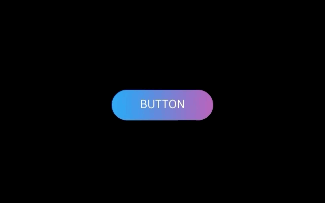](https://github.com/Dev-JeromeBaek/awesome-web-styling/tree/master/button/glowing-gradient-button-effects-on-hover)

[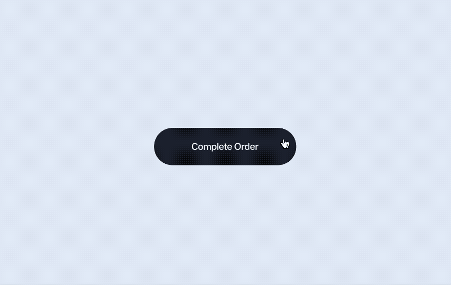](https://github.com/Dev-JeromeBaek/awesome-web-styling/tree/master/button/delivery-truck-on-road-button)
[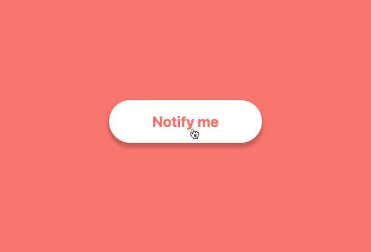](https://github.com/Dev-JeromeBaek/awesome-web-styling/tree/master/button/subscription-button-with-regex)

---

### Canvas

<!-- 
 -->

---

### Card

---

### Checkbox

[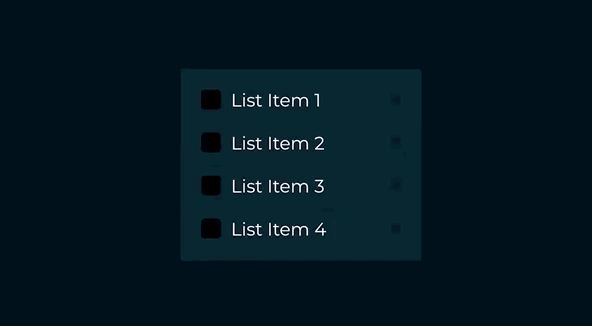](https://github.com/Dev-JeromeBaek/awesome-web-styling/tree/master/checkbox/css-custom-checkbox-list-design)
[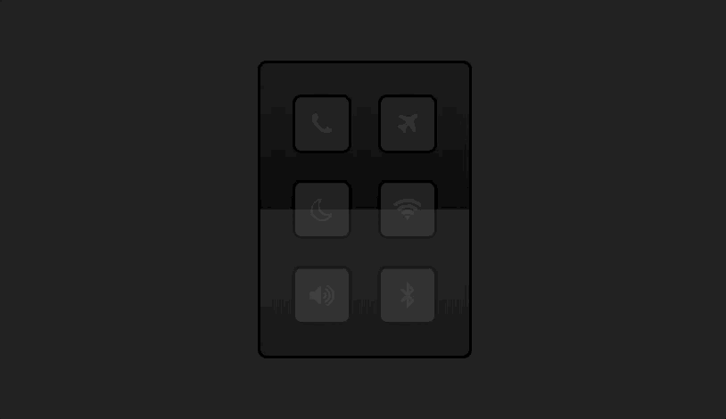](https://github.com/Dev-JeromeBaek/awesome-web-styling/tree/master/checkbox/glowing-checkbox-button-design)

---

### Form

---

### Hamburger

---

### Icon

---

### Indicator

---

### Layout

---

### List

[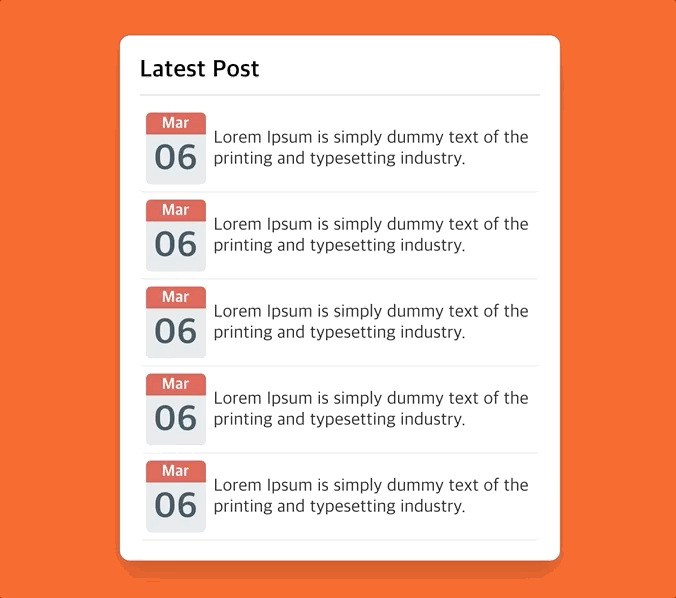](https://github.com/Dev-JeromeBaek/awesome-web-styling/tree/master/list/post-list-ui-design)
[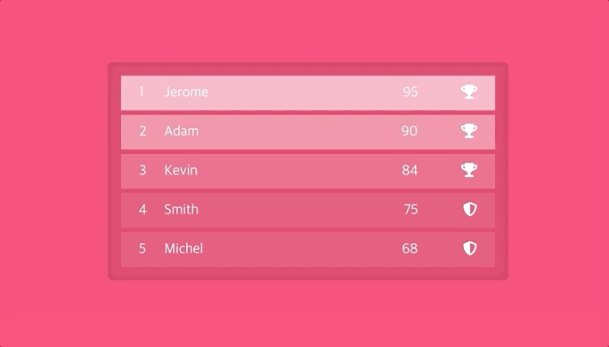](https://github.com/Dev-JeromeBaek/awesome-web-styling/tree/master/list/style-lists-with-css-hover-effect)

---

### Loading

---

### Modal

---

### Mouse

---

### Navigation

---

### Neumorphism

[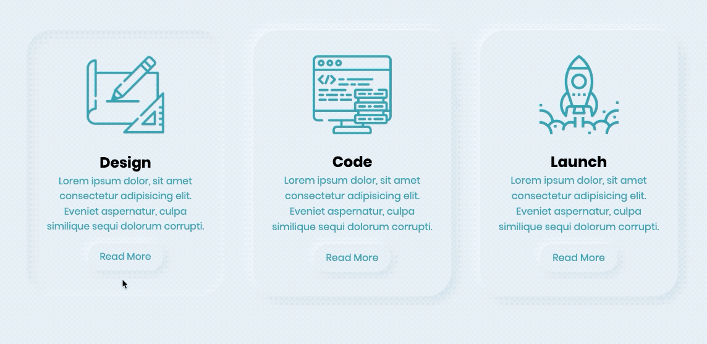](https://github.com/Dev-JeromeBaek/awesome-web-styling/tree/master/neumorphism/neumorphism-card-ui-hover-effects)

---

### Page Design

---

### Scrolling

[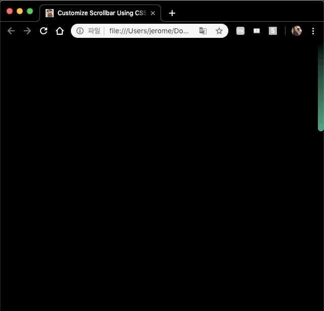](https://github.com/Dev-JeromeBaek/awesome-web-styling/tree/master/scrolling/customize-scrollbar-using-css)
[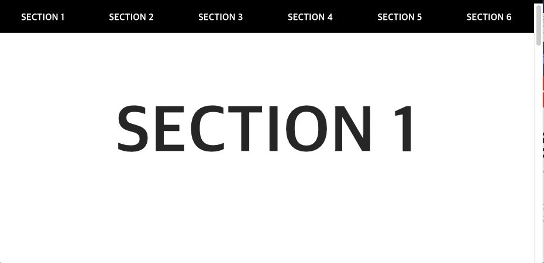](https://github.com/Dev-JeromeBaek/awesome-web-styling/tree/master/scrolling/smooth-scrolling-effect)
[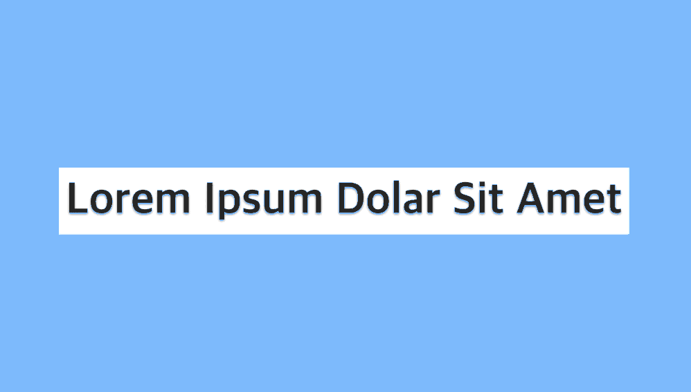](https://github.com/Dev-JeromeBaek/awesome-web-styling/tree/master/scrolling/trigger-css-animate-on-scroll)

---

### Selectbox

---

### Slider

[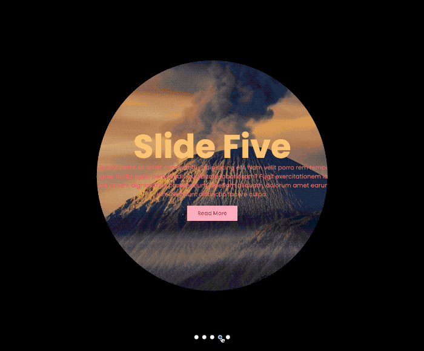](https://github.com/Dev-JeromeBaek/awesome-web-styling/tree/master/slider/capture-effect-slider)
[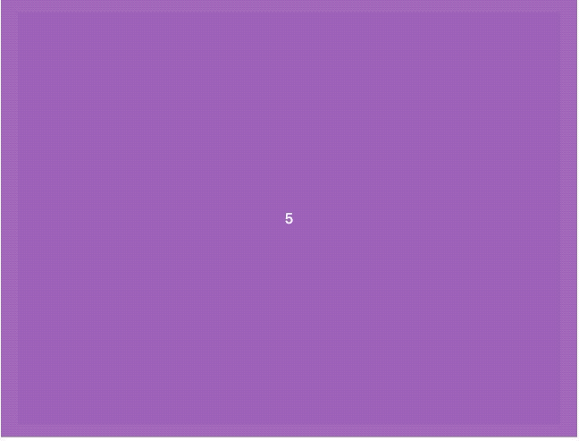](https://github.com/Dev-JeromeBaek/awesome-web-styling/tree/master/slider/simple-vanilla-js-carousel-slider)

---

### Text

[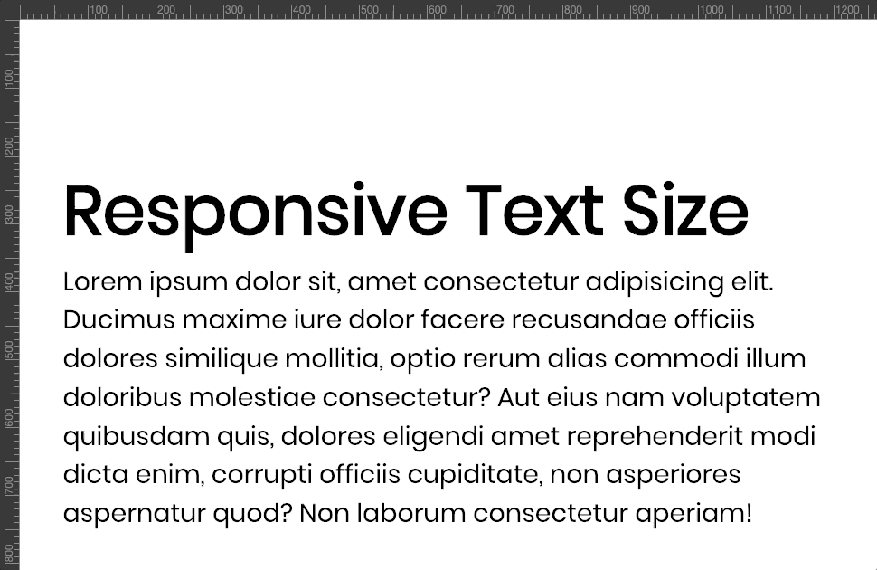](https://github.com/Dev-JeromeBaek/awesome-web-styling/tree/master/text/responsive-text-size)
[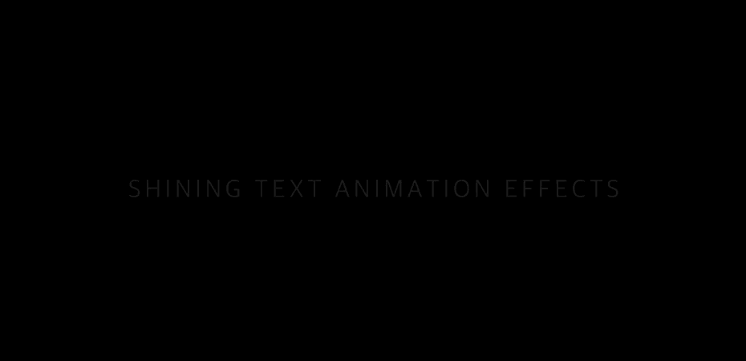](https://github.com/Dev-JeromeBaek/awesome-web-styling/tree/master/text/shining-text-animation-effects)

[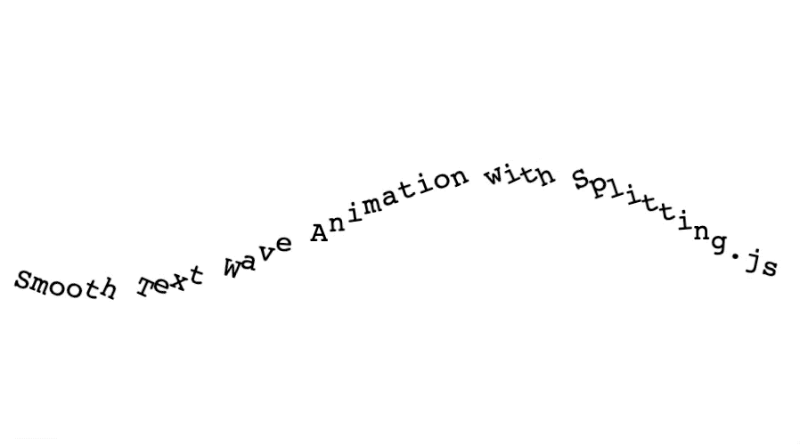](https://github.com/Dev-JeromeBaek/awesome-web-styling/tree/master/text/wavy-text-animation-effects)

---

### Thumbnail

---

### Tooltip

---

### Web Site Template

