# Grid 정리

### 기본 시작 스타일


### 구조

grid.html

```
<section class="grid"> // grid
  <div class="card">$</div> // card * 8
</section>
```

grid.css

```
.grid {
    display: grid; // 1200px 고정으로진행;
}
.card {
  border: 2px solid #000;
  background: #ffa94d;
  font-size: 16px;
  padding: 5px;
  text-align: center;
 }
```

#### 1. display: grid;

```
.grid {
    display: grid;
}
```


#### 2. grid-template-colums (4 : 6)

```
.grid {
    display: grid;
    // grid-template-colums: 40% 60%;  // 방법 1
    grid-template-columns: 4fr 6fr; // 방법 2
}
```


- 2번 방법을 더 많이 사용함.
  - gap(여백) 설정에 대한 문제 때문,

> [참고]
>
> 다음과 같이 분할하는 방법 또한 존재함.
>
> 1. repeat

```
.grid {
	...
    grid-template-columns: repeat(3, 1fr); // 방법 3
	// 1fr씩 3번 반복 하겠다. (3번, 4번)
	grid-template-columns: 1fr 1fr 1fr; // 방법 4
}
```


> 1. (px고정) fr;

```
.grid {
	...
    grid-template-columns: repeat(3, 1fr); // 방법 3
	// 1fr씩 3번 반복 하겠다. (3번, 4번)
	grid-template-columns: 1fr 1fr 1fr; // 방법 4
}
```

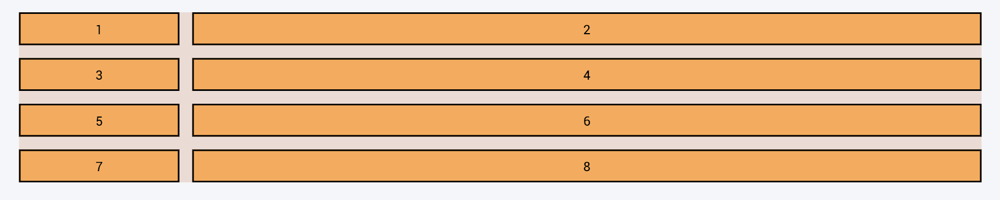

#### 3. grid-gap

1. fr을 사용하는 경우

```
.grid {
	...
    grid-template-columns: 4fr 6fr; // 방법 2
    grid-gap: 1rem;
}
```

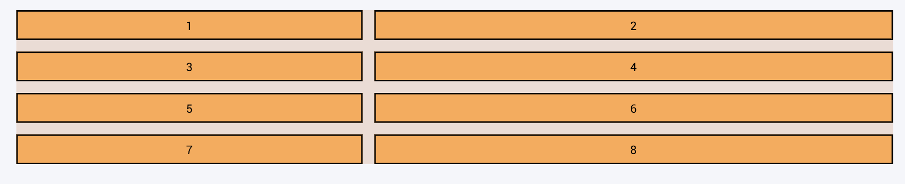


- box-sizing: border-box와 같이 전체 1200px에는 영향을 주지 않음.

1. %를 사용하는 경우

```
.grid {
	...
    grid-template-columns: 4% 6%; // 방법 1
    grid-gap: 1rem;
}
```

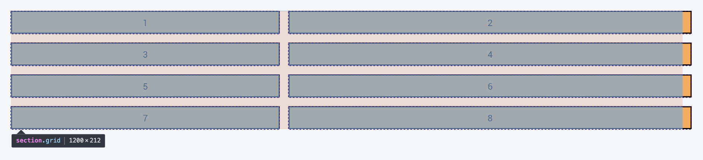

- box-sizing: content-box 와 같이 여백만큼 밀려남.

#### 4. grid-auto-rows 칸의 높이 맞추기

1. 기본적으로 내용에 따라 크기가 다르지만 이를 똑같이 맞춰줄 수 있음.

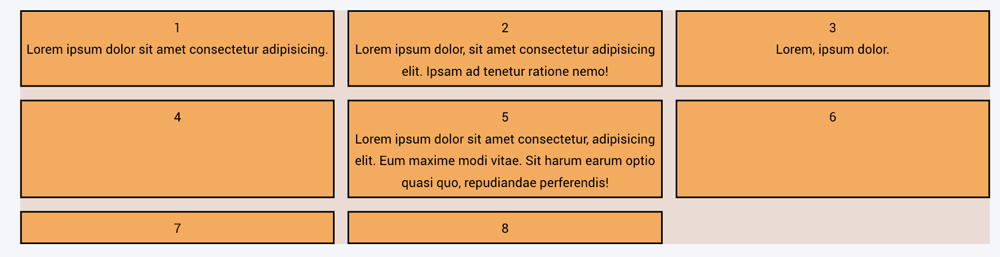

```
.grid {
	display: grid;
    grid-template-columns: 1fr 1fr 1fr;
    grid-gap: 1rem;
    grid-auto-rows: 150px;
}
```


1. 높이를 맞췄지만 내용이 넘친다면? (7번)

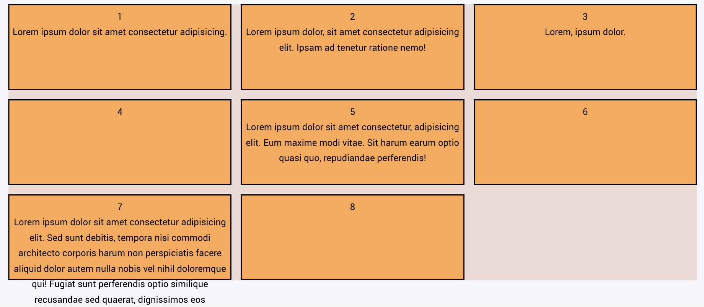

```
.grid {
	display: grid;
    grid-template-columns: 1fr 1fr 1fr;
    grid-gap: 1rem;
    // grid-auto-rows: 150px;
  	grid-auto-rows: minmax(12em, auto);
}
```

- minmax(기본설정값, auto);

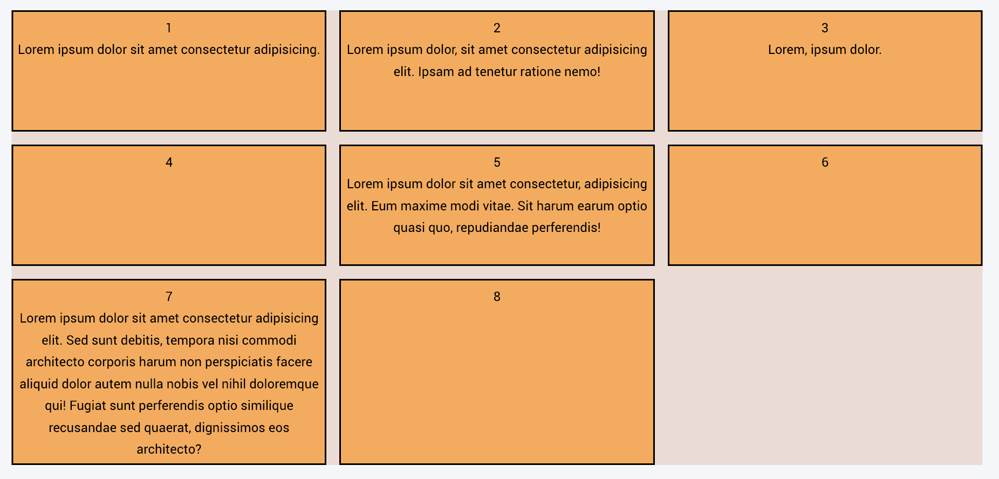

- 최소 크기를 200px로 정하고 더 필요한 경우 contents 내용에 맞춘다.

#### 5. justify-items (정렬)

```
.grid {
	display: grid;
  	grid-template-columns: 1fr 1fr 1fr;
  	grid-auto-rows: minmax(12em, auto);
  	grid-gap: 1rem;
    justify-items: end;
}
```

1. start


1. center

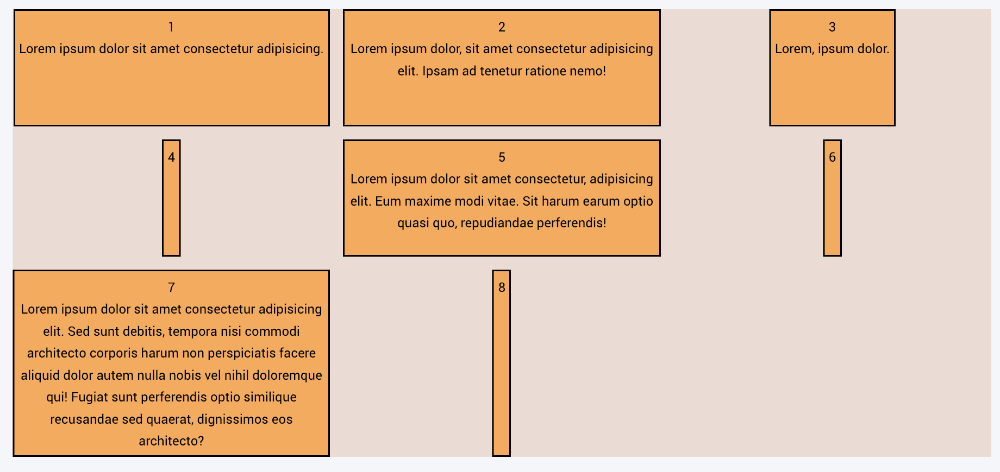

1. end


#### 6. align-items (정렬)

```
.grid {
	display: grid;
  	grid-template-columns: 1fr 1fr 1fr;
  	grid-auto-rows: minmax(12em, auto);
  	grid-gap: 1rem;
    align-items: end;
}
```

1. start


1. center


1. end

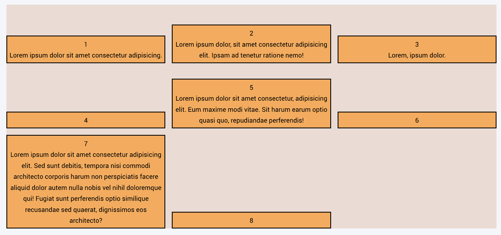

#### 7. justify-self, align-self (각각의 컨텐츠 정렬)

```
.grid {
	display: grid;
  	grid-template-columns: 1fr 1fr 1fr;
  	grid-auto-rows: minmax(12em, auto);
  	grid-gap: 1rem;
}
.card:nth-child(4) {
    justify-self: start;
    align-self: center;
}
```

1. justify-self: start; align-self: center;

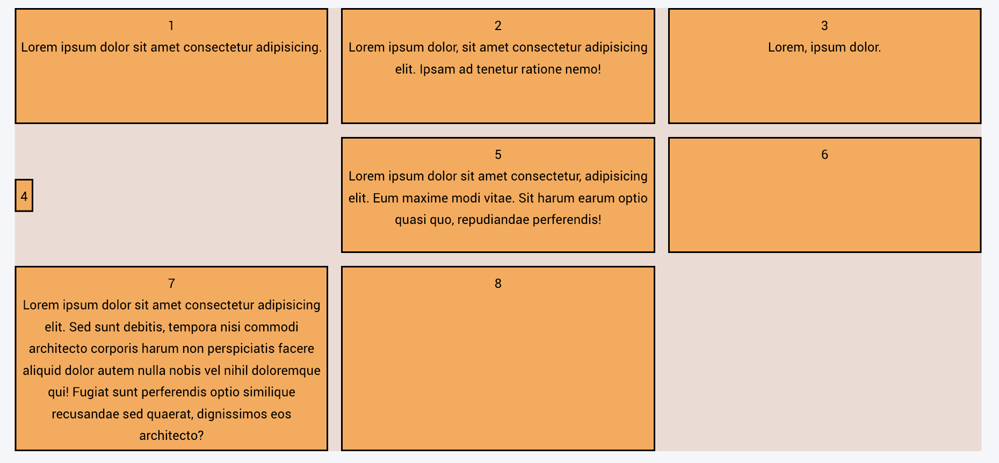

1. justify-self: center; align-self: center;

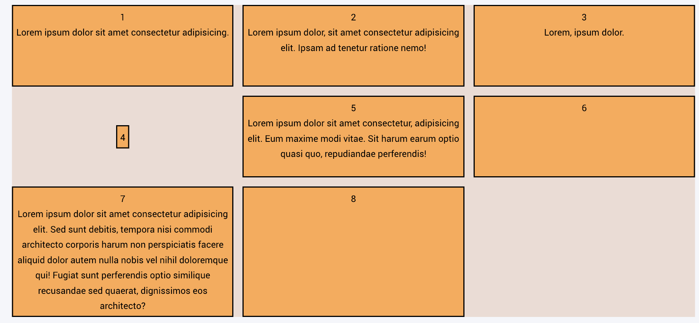

1. justify-self: end; align-self: end;


#### 8. 다양한 크기의 grid (각각의 컨텐츠 정렬)

1. grid-column

```
.grid {
	display: grid;
  	grid-template-columns: 1fr 1fr 1fr;
  	grid-auto-rows: minmax(12em, auto);
  	grid-gap: 1rem;
}
.card:nth-child(4) {
    grid-column: 1/4;
}
```

- 1/4 (x좌표 0부터 4까지 갯수가 3개지만 4로 적힌 이유는 시작점포함 1로 계산되기 때문.)


1. grid-row

```
.grid {
	display: grid;
  	grid-template-columns: 1fr 1fr 1fr;
  	grid-auto-rows: minmax(12em, auto);
  	grid-gap: 1rem;
}
.card:nth-child(5) {
    grid-row: 3/5;
}
```


1. 5번을 오른쪽 끝으로 이동시키기

```
.grid {
	display: grid;
  	grid-template-columns: 1fr 1fr 1fr;
  	grid-auto-rows: minmax(12em, auto);
  	grid-gap: 1rem;
}
.card:nth-child(5) {
	grid-column: 3; // 시작점 잡아주기
    grid-row: 3/5;
}
```

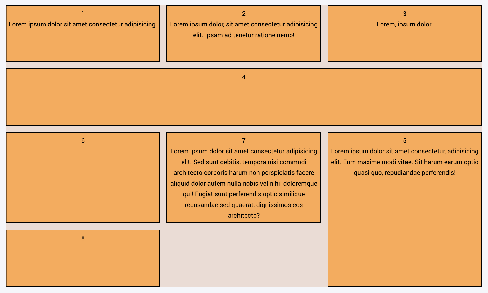

#### 9. 영역 침범하기

- ...
- ...
